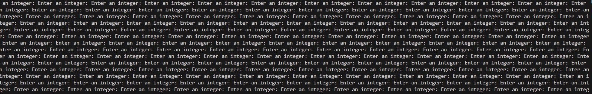

# Session 3 - The Finale

This is the final session! Since people did not finish the previous session, this will be a short one and will just cover inputs and debugging. 

Good luck and happy coding!

## Contents 

- <a href="#Input" style="color: black;"> Handling Input </a>
    - <a href="#CharInput" style="color: black;"> Character Input </a>
    - <a href="#Fgets" style="color: black;"> String Input (fgets) </a>
    - <a href="#IntInput" style="color: black;"> Int Input </a>
    - <a href="#InputExercises1" style="color: black;"> Input Exercises 1 </a>
    - <a href="#RetryIntInput" style="color: black;"> Retrying Input </a>
    - <a href="#InputExercises2" style="color: black;"> Input Exercises 2 </a>
- <a href="#GDB" style="color: black;"> Debugging With GDB </a>
- <a href="#Optional" style="color: black;"> Optional Exercises </a>

## <a name="Input"> Input </a>

We are covering **input** so we can *finally* create interactive programs in **C**! We will focus on using **scanf** (in `stdio`) to read in user input. 

### <a name="CharInput"> Character Input </a>

For **scanf** to read in a character, we need to pass it a pointer to a char variable! If we passed the value, then it wouldn't be able to fill in the variable for us. 

```c
char a;
scanf("%c", &a); // read in a character! Store in the variable 'a'
printf("%c\n", a); // print out that character!
``` 

We can also read in multiple characters! 

```c
char a,b,c;
scanf("%c%c%c", &a, &b, &c); // read in 3 characters!
printf("%c%c%c\n", a, b, c); // print out those characters!
```

You might wonder *why* scanf doesn't just return the value (or a pointer to the value). This is because `scanf` returns the number of items that were successfully read in! We can inspect this behaviour closely with the following: 

```c
char a,b,c,d;
int nReads = scanf("%c%c%c%c", &a, &b, &c, &d); // read in 4 characters!

printf("%d\n", nReads);
```

If you compile and run the program (located in `cFiles/input/nReplacements.c`), then you'll notice that trying to enter just one character won't work! The program simply waits until you enter more characters (even if it's a newline or a space) - to observe this behaviour, we'll have to pipe input from a file to the program. We can do this using the following command:

```bash
cat theFile | ./theProgram
```
*Here, cat outputs the contents of the file and the pipe character **'|'** pipes the output to the executed program*

So compile `cFiles/input/nReplacements.c`, and try piping in some input (try `txtFiles/input/nReplacementsInput1.txt`)! 

### <a name="Fgets"> String Input (fgets) </a>

Of course, we want to input more than one character! Ideally we'd like to input entire strings, which we can do in a couple different ways. First, we'll have to consider the different ways that the program can know the string has been fully read in: 

- a fixed number of characters has been read in 
- a certain character has been reached (newline or space)

We can already figure out how to take in a fixed number of characters using `scanf` on chars and a for loop:

```c
#include <stdio.h>
#define nChars 15 

int main(){
    char ourString[nChars]; // can't do this with variables; have to use macros! 

    for(int i = 0; i < nChars-1; i++){
        scanf("%c", ourString+i); // recall that an array can be treated as a pointer
    }

    ourString[nChars-1] = '\0'; // needed to make it a proper string
    printf("%s\n", ourString);

    return 0;
}
```

Note that we're using the macro `nChars` in a way that you *cannot* use a variable, since the length of an array cannot be defined by a variable. Therefore, a macro is needed which replaces `nChars` with `15` at compile-time (in preprocessing, before the program is executed).  

Also, we are making our string a proper string by ending it with a terminal character however we don't always *have to* make it a proper string depending on our use-case. For example, if we just want to check characters in the input for a certain condition then we don't have to store it as a proper string; in fact, we don't have to store it at all! 

Reading in a string like this is kind of effort so there's a function for that: `fgets`. Let's look at the prototype for `fgets`:

```c
char* fgets(char *aString, int n, FILE *aStream);
```

Let's dissect this:
1) The first argument `aString` is just our string (a pointer to the first character).
2) The second argument `n` is the maximum length that we're getting from input (if `n=10` and the input only has `6` characters, then our string will simply have 6 characters). 
3) The third argument is the stream we're getting input from (don't worry about the types); in our case, we'll use `stdin` which is a variable referring to the **st**an**d**ard **i**nput. 
4) The return argument is a pointer to the new string. If it's successful, then this is just the same as `aString` (unless `aString` is an array, which decays after being passed through `fgets`). If it's not successful, then it is the null pointer. 

Here's an example of using `fgets`:
```c
#include <stdio.h>
#define nChars 15 

int main(){
    char ourString[nChars]; // can't do this with variables; have to use macros! 

    char* sP = fgets(ourString, nChars, stdin);

    if(sP == NULL){
        printf("Uh oh spaghettios\n");
        return -1;
    }

    printf("Output: %s\n", ourString); // or using sP
}
```

This is all well and good, but there's an issue... we've already mentioned that you can input fewer than expected characters. So how do we know the size of the string? The return value of `fgets` will just be a pointer (so `sizeof` will give the size of a pointer), and `ourString` has the same size as when it was originally declared: 

```c
printf("Size of string: %d %d \n", sizeof(ourString), sizeof(sP)); // oh no :( wrong string lengths!
```

So how do we get the actual length? We would have to loop through the string, until we locate the null character! We don't have to do this ourselves, if we use the **string library** (`<string.h>`); it provides us with the `strlen` function! 
```c
#include <string.h>
```

```c
printf("Actual size of string: %d \n", strlen(ourString)); // includes the '\n' if there is one 
```

### <a name="ScanfString"> String Input (using scanf) </a>

Okay, so what about if we want to read in words; that is, we read in characters until we encounter a space. We can use `scanf` and **%s** for that!

```c
char hugeString[100];
scanf("%s", hugeString);

printf("%s\n", hugeString);
```

Using `%s` will read in the characters until a space character is encountered. 

### <a name="IntInput"> Int Input </a>

Similarly to strings, you can input an int with **%d**. 

```c
printf("Enter your number: ");

int d;
scanf("%d", &d);

printf("Your number is... %d!", d);
```

Unlike strings however, integers can have invalid inputs; you can try to read in an integer and fail! This is where the return argument of `scanf` comes in handy:

```c
int d;
int n = scanf("%d", &d);

if(n == 1){ // success! 
    printf("Your number is... %d!\n", d);
}else{ // no replacements, so no integer :(
    printf("That is not an integer >:( \n");
}
```

After these next exercises, we'll see how we might handle repeatedly asking the user to provide an integer (until they do).

### <a name="InputExercises1"> Input Exercises 1 </a>

1) Bob is following the course and mistakenly has written: 
```c
char a;
scanf("%c", a);
printf("%c\n", a);
```

What mistake has Bob made? What should he have written? What will happen, and what will the output be? What is this an example of? 

**Hint:** Read the first paragraph of <a href="#CharInput"> Character Input </a>

2) Read the solution to Exercise 1. 

3) Write a program that asks for the user's first name and second name, and then outputs it back to them! 

4) A program requires you to input the length of the string, and then the string itself. Can you output the number of times the character 'e' appears in the string? 

Assume that the user correctly enters input and test the program using the inputs in `txtFiles/InputEx3/Input` which has corresponding correct outputs in `txtFiles/InputEx3/Output`.

**Hint:** We know how to make a string with the size of a variable `n` from memory management last session! 

### <a name="RetryIntInput"> Retrying Int Input </a>

At first, this doesn't seem to be a hard problem; let's just keep on inputting using **%d** until the user gives us a valid integer (which we can check using the return value of `scanf`):

```c
int d; 
int n = 0;

while(n == 0){ // keep asking until we get 1 replacement!
    printf("Enter an integer: ");
    n = scanf("%d", &d);
}
```

But as soon as we enter an invalid integer, this happens:



Uh oh, we messed up. How did this happen?

**scanf** doesn't just input values; it *scans* for the desired inputs and if it doesn't read something in successfully, then it just leaves that in the input stream. In the case where the user doesn't provide a valid integer, `scanf` does not read in an integer and therefore it doesn't take the input out of the stream. So then it tries to read that same input again (since it's still there). And again. And again. 

So we need a way of clearing that invalid input from the stream! We can do this by reading in the invalid input as a string, and then discarding it. We can do this by putting a **\*** between the **%** and the format specifier symbol (in this case, an **s**). So, let's update our loop: 

```c
while(n == 0){ // keep asking until we get 1 replacement!
    printf("Enter an integer: ");
    n = scanf("%d", &d);

    if(n == 0){
        scanf("%*s"); // we don't need to provide a pointer to a string, if it just discards it!
    }
}
```

Note that the use of **%\*s** means we don't have to provide a place to store the string (since the **\*** tells `scanf` to throw it away!)

Let's make this a neat little function: 

```c
int requestInteger(char* str){
    int d; 
    int n = 0;

    while(n == 0){ // keep asking until we get 1 replacement!
        printf("%s", str);
        n = scanf("%d", &d);

        if(n == 0){
            scanf("%*s"); // we don't need to provide a pointer to a string, if it just discards it!
        }
    }

    printf("\n"); 

    return d;
}
```

(This function will do something a bit odd if your invalid input contains multiple words; can you see why?)

### <a name="InputExercises2"> Input Exercises 2 </a>

1) I am designing an RPG and I want to user to input how many points they wish to put into a stat. My RPG currently only has the **strength** stat. Design a program to ask user to enter how many points they wish to invest (and keep asking until they input a valid number of points); output their strength stat, and the number of points remaining.

```c
int statPoints = 10; 
int strength = -1;
int pointsRemaining; 

// write code to allow the user to allocate points 
```

2) Extend this to also ask how many points they wish to enter into **vitality** afterwards. Output this stat in addition to strength and the number of points remaining. 

3) Given an array of strings of stats, can you write a program to request the user to allocate points to all of them?

```c
int statPoints = 100; 
int stats[5];
char* statNames[] = {"Strength", "Vitality", "Agility", "Intelligence", "Charisma"};
int pointsRemaining; 

// write code to allow the user to allocate points 
```

It will help to use the **strcat** function inside of `<string.h>`, which you can use like so:

```c
char name[50] = "Edward ";
strcat(name, "Denton");

printf("%s\n", name); // Edward Denton 
```

## <a name="GDB"> Debugging With GDB </a>

GNU provides us with the compiler (GCC), but it also gives us **GDB** which stands for **G**NU **D**e**b**ugger. Since we have undefined behaviour in **C** and minimal error messages, it's very useful to be able to step through our program (which is what GDB does)!

Let's consider a problematic program: 

```c
#include <stdio.h>

void brokenFunction(){
    int* lastLocation = 10000;

    for(int* i = 0; i < lastLocation; i++){
        // WOOO LET'S OVERWRITE UNAUTHORISED MEMORY LOCATIONS
        *i = 1;
    }
}

int main(){
    int a = 5;
    printf("uh oh, we're about to break...\n");

    brokenFunction();

    return 0;
}
```

You can find this program in `cFiles/GDB/brokenProgram.c`. 

Let's run it using GDB by first compiling it with special flags (so that we get extra information while using GDB):

```bash
gcc cFiles/GDB/brokenProgram.c -g -o bP
```
*-g is the special flag which gives us extra information*

We don't actually *need* to add `-g` to use GDB, however it helps (since it adds nice debugging information).

Now we can run the program with GDB:

```bash
gdb ./bP
```

We now get an interactive mode that looks a little like this:
```bash
(gdb) 
```

We can run the program inside gdb using the `run` command! This should run until your encounter an error. Once an error is encountered, we can check the state of the program in a couple ways:

1) Printing the values of variables in the program. We can do this using `print <varName>`. In the case of our program, we might use `print i`. 

2) Printing the stack trace of the program; this reveals what functions were called before. We can do this using `bt` (**bt** for **b**ack**t**race).

Finally, you can quit gdb by typing `quit` or `q` for short. 

### <a name="Breakpoints"> Breakpoints </a>

Sometimes, we don't want to just pause when we encounter an error; we might want to pause at a specific point! We can add a breakpoint with `break cFile:<lineNumber>`. Note that we have to enter the name of the **C** file because it may be that our program is composed of several different **C** files. An example would be `break brokenProgram.c:5`.

Once we hit the breakpoint, we can then run commands as before (like `print` and `bt`). Once we're done, we can continue past the breakpoint with `continue` or step through the program, line by line, with `step`. 

## <a name="OptionalExercises"> Optional Exercises </a> 

1) For the sake of brevity, I did not mention patterns that you can use with **scanf** (similar to regex, if you've used that). Read through [documentation for scanf](https://www.ibm.com/docs/en/i/7.4?topic=functions-scanf-read-data).

2) Research Valgrind which is a tool you can use alongside GDB to debug your programs! 

## Acknowledgements

Originally created by Edward Denton. 
